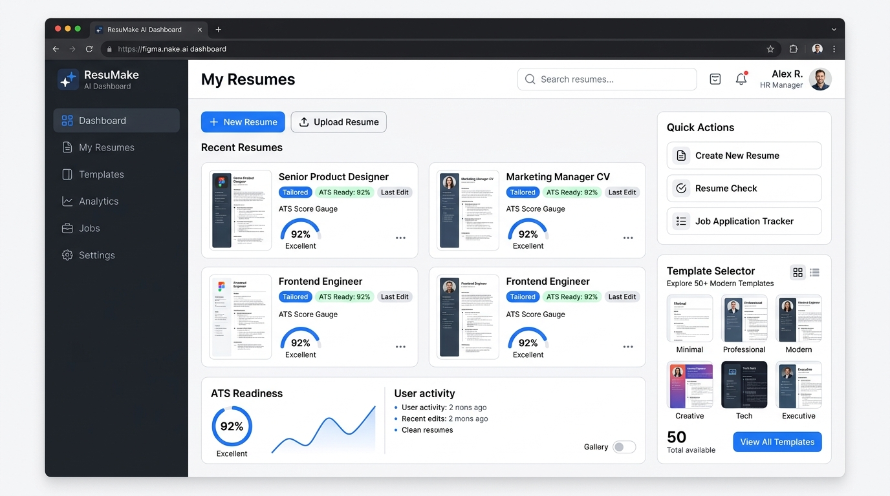
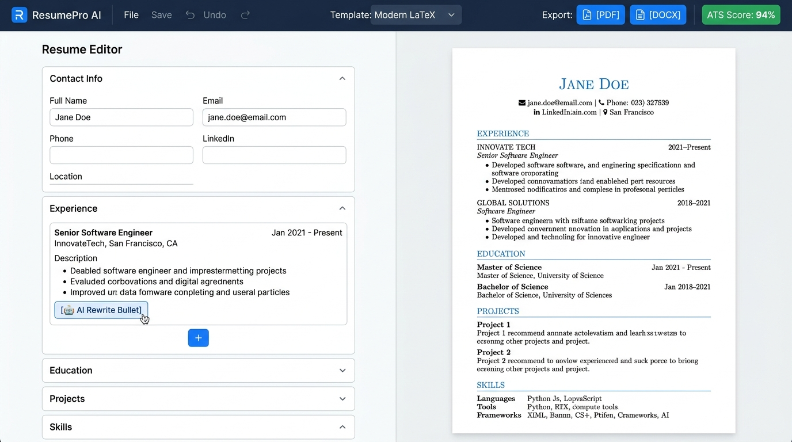
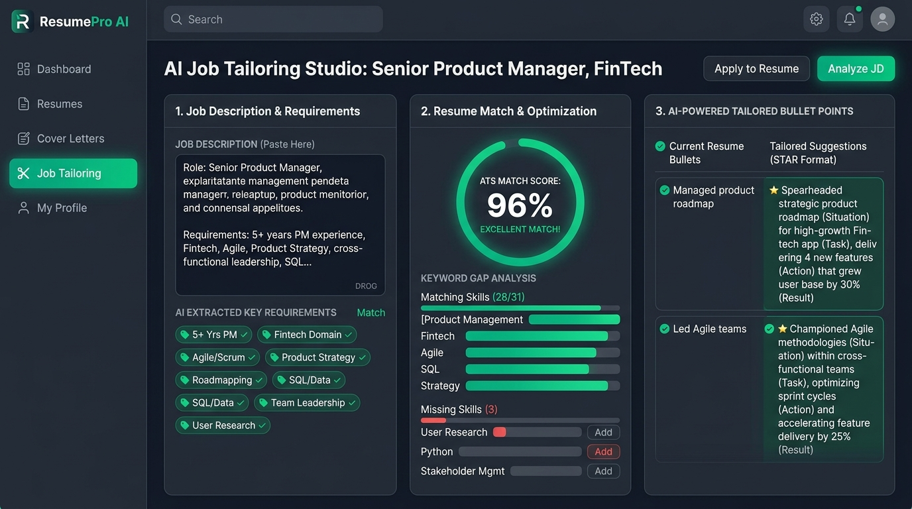
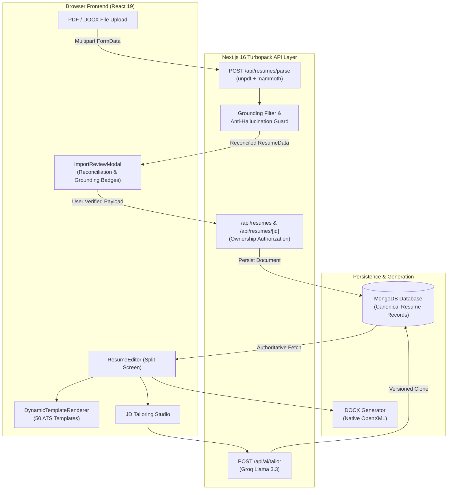

# 📄 ResumeBuilder AI — Next-Gen Resume Intelligence & ATS Platform

[](https://nextjs.org/)
[](https://react.dev/)
[](https://www.typescriptlang.org/)
[](https://tailwindcss.com/)
[](https://mongoosejs.com/)
[](LICENSE)

An enterprise-grade, production-hardened Resume Intelligence and ATS platform built with Next.js 16 (Turbopack), React 19, MongoDB, and Tailwind CSS 4. Features server-safe forensic document parsing (PDF & DOCX) with zero-hallucination grounding filters, 50 Overleaf/LaTeX-calibrated ATS templates, deep Job Description tailoring, multi-format export (PDF + native DOCX), and strict multi-tenant user isolation.

---

## 📸 Platform Showcase

| Executive Dashboard | Live Split-Screen Editor | AI Job Tailoring Studio |
| :---: | :---: | :---: |
|  |  |  |

---

## 🌟 Key Capabilities

### 1. Forensic Parser & Zero-Hallucination Engine
- **Server-Safe PDF Extraction**: Built on `unpdf` with zero `canvas`, `DOMMatrix`, or browser polyfill dependencies—guaranteeing 100% reliable execution on Vercel Node.js serverless functions.
- **DOCX Direct Extraction**: Native binary header parsing via `mammoth`.
- **Grounding Filter**: Discards any entity or skill lacking exact character-level substring evidence in the source document.
- **Strict Entity Boundary Protection**: 
  - $N$ source projects $\rightarrow$ exactly $N$ parsed items (0 projects in source strictly yields 0 projects in editor).
  - Dates inside bullet points (`"Promoted in Summer 2022"`) are never misclassified as phantom jobs.
  - Zero placeholder string contamination (`"Company"`, `"Role"`, `"Institution"`, `"Project"` are forbidden).
- **Source-to-Output Reconciliation**: Emits a `ParsingValidation` audit matrix verifying section-by-section counts and consistency before entering the editor.

### 2. Database-First Canonical Persistence
- **Single Source of Truth**: MongoDB records serve as the authoritative state. Client storage (`localStorage`/`sessionStorage`) operates strictly as emergency offline cache.
- **Sanitized Ingestion**: Automatically cleanses temporary client-generated IDs (`import_*`) on `POST /api/resumes`, preventing Mongoose `CastError` and returning canonical Mongo ObjectIDs.
- **Strict Multi-Tenant Isolation**: Authorizes ownership on every `GET`, `PUT`, `DELETE`, and `duplicate` route (`403 Forbidden` if `resume.userId !== authenticatedUser.userId`).
- **Zero Demo Contamination**: Unauthorized or deleted states cleanly redirect to `/dashboard` or initialize a clean blank document—never substituting demo data.

### 3. 50 Overleaf/LaTeX-Grade ATS Templates
- **7 Industry Categories**: General Professional, Software/Tech, Data & Analytics, Students/Freshers, Business/Management, Academic/Research, Specialized/Industry.
- **Diverse Architectural Layouts**:
  - `single-column`: Classic Overleaf serif and modern linear ATS standard.
  - `left-rail`: Elegant two-column sidebar layout for skills, education, and credentials alongside core experience.
  - `executive`: Distinct bold accent headers with corporate balance.
  - `compact`: Dense 1-page calibrated typography with tight vertical rhythm.
- **Zero Data Loss Guarantee**: Universal canonical data binding ensures switching templates preserves 100% of resume fields (including projects, publications, coursework, awards, and interests).

### 4. Deep Job Description Tailoring Studio
- **STAR Methodology Bullets**: Rewrites and sharpens bullet points into Situation-Task-Action-Result format based on real accomplishments without fabricating metrics.
- **Keyword Gap Analysis**: Highlights matching competencies vs. missing keywords from the target JD.
- **Non-Destructive Versioning**: Generates a distinct tailored copy linked by `baseResumeId`, keeping the candidate's master resume untouched.

### 5. Multi-Format High-Fidelity Export
- **Print & PDF Engine**: Tailored CSS print stylesheets with `@page` sizing, zero margin clipping, and clean page-break guards.
- **Native DOCX Generator**: Generates clean, ATS-compliant Microsoft Word `.docx` documents matching the canonical resume hierarchy.

---

## 🏛️ System Architecture



---

## 📂 Repository Structure

```text
├── app/
│   ├── api/
│   │   ├── ai/improve/route.ts         # Bullet point enhancer
│   │   ├── ai/tailor/route.ts          # Job Description tailoring engine
│   │   ├── auth/                       # JWT Authentication routes (login, register, me)
│   │   ├── resumes/route.ts            # Canonical list & create endpoints
│   │   ├── resumes/[id]/route.ts       # Authorized GET, PUT, DELETE endpoints
│   │   ├── resumes/[id]/duplicate/     # Authorized clone endpoint
│   │   └── resumes/parse/route.ts      # Server-safe PDF & DOCX forensic parser
│   ├── auth/                           # Login and Registration pages
│   ├── dashboard/page.tsx              # Executive Resume Dashboard
│   ├── editor/[id]/page.tsx            # Full Split-Screen Resume Editor
│   └── templates/page.tsx              # 50-Template Showcase Gallery
├── src/
│   ├── components/
│   │   ├── editor/ResumeEditor.tsx     # Split-screen editor with DB-first hydration
│   │   ├── import/ImportReviewModal.tsx# Parsed verification modal with grounding badges
│   │   ├── tailoring/                  # Job tailoring modal & keyword gap analysis
│   │   └── templates/
│   │       ├── DynamicTemplateRenderer.tsx # Multi-layout 50-template renderer
│   │       └── TemplateRenderer.tsx    # Universal template dispatcher
│   ├── lib/
│   │   ├── docx-generator.ts           # Native ATS Word document generator
│   │   ├── resume-normalizer.ts        # Canonical schema normalizer
│   │   ├── resume-parser.ts            # Forensic parser with grounding filter
│   │   ├── templates-registry.ts       # 50 template definitions across 7 categories
│   │   └── mongodb.ts                  # Cached MongoDB connection manager
│   └── types/
│       └── resume.ts                   # Canonical TypeScript resume data models
├── scratch/                            # Autonomous verification & test suites
│   ├── test-forensic-parser-corpus.mjs # 7-Case forensic test corpus (Resumes A–G)
│   ├── test-parser-suite.mjs           # 17-Case parsing test suite
│   ├── test-intelligence-pipeline.mjs  # 11-Case intelligence & tailoring tests
│   └── test-production-hardening.mjs   # 8-Case database isolation & export tests
└── docs/
    └── screenshots/                    # High-resolution documentation previews
```

---

## 🚀 Getting Started

### Prerequisites
- **Node.js**: `v20+` or `v22+` (tested on Node v26)
- **MongoDB**: Local instance or MongoDB Atlas cluster URI
- **npm** or **pnpm**

### Installation

1. **Clone the repository**:
   ```bash
   git clone https://github.com/AnzarKhan855/resume-builder.git
   cd resume-builder
   ```

2. **Install dependencies**:
   ```bash
   npm install
   ```

3. **Configure Environment Variables**:
   Create a `.env.local` file in the root directory:
   ```env
   # Database
   MONGODB_URI=mongodb://localhost:27017/resume-builder

   # Authentication
   JWT_SECRET=your-secure-random-jwt-secret-at-least-32-chars

   # AI Acceleration (Optional, for semantic Groq parsing & JD tailoring)
   GROQ_API_KEY=your_groq_api_key_here
   ```

4. **Run Development Server**:
   ```bash
   npm run dev
   ```
   Open [http://localhost:3000](http://localhost:3000) in your browser.

---

## 🧪 Comprehensive Automated Test Suites

The repository contains automated test suites verifying parsing fidelity, anti-hallucination guards, database isolation, template integrity, and document export:

```bash
# 1. Forensic Test Corpus (Resumes A through G)
npx tsx scratch/test-forensic-parser-corpus.mjs

# 2. Complete 17-Case Resume Parser Test Suite
npx tsx scratch/test-parser-suite.mjs

# 3. Intelligence & JD Tailoring Pipeline Suite
npx tsx scratch/test-intelligence-pipeline.mjs

# 4. Database-First Production Hardening & User Isolation Suite
npx tsx scratch/test-production-hardening.mjs
```

### Quality Verification
```bash
# Code Style & Linting (0 errors, 0 warnings)
npm run lint

# Production Next.js 16 Turbopack Compilation (21 routes)
npm run build
```

---

## 🔒 Security & Privacy

- **Strict User Isolation**: All resume reads, updates, duplications, and deletions enforce user identity matching via signed JWT tokens. Cross-account access attempts return `403 Forbidden`.
- **Input Sanitization**: Client-side document payloads and string identifiers are validated and cleansed before database persistence.
- **Zero Telemetry Leakage**: Extracted document details are processed exclusively within the isolated runtime and stored within your private MongoDB database.

---

## 📄 License

This project is licensed under the MIT License — see the [LICENSE](LICENSE) file for details.
